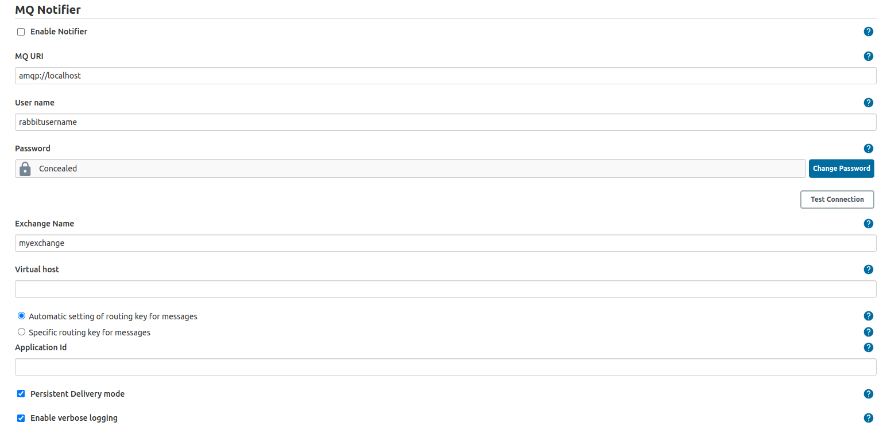

# MQ Notifier Plugin

This plugin sends a message to an MQ e.g. RabbitMQ each time a build is started and finished. The plugin also sends a message every time a build is added and removed from the queue. By extending this plugin, developers can add events for when to send messages.

## General information

The plugin connects to an MQ, e.g. RabbitMQ and sends messages during specific events. In its first version, the messages are sent when:

-   A build is added to the queue
-   A build leaves the queue (either to be built or is cancelled)
-   A build starts
-   A build finishes (either when the build is finished or when it is aborted)

The basic use case is for other systems to interact with Jenkins. An example is a system that triggers a build using the rest API of Jenkins, then waits for the build to finish. The system wants to present information about these builds. The alternative to listening to an MQ is for the system to continuously poll Jenkins for information of the build status.

Other events can be added to the plugin by extending it.

## Message format

### Entering queue

"state":"QUEUED","url":"http://urltojenkins:port/jenkins/job/myjob/","parameters":"\["parameter1":"parametervalue","parameter2":"otherparametervalue"\]"

### Leaving queue

"state":"DEQUEUED","DEQUEUE\_REASON":"BUILDING","url":"http://urltojenkins:port/jenkins/job/myjob/","parameters":{"parameter1":"parametervalue","parameter2":"otherparametervalue"}

### Build started

"state":"STARTED","url":"http://urltojenkins:port/jenkins/job/myjob/buildnumber/","causes":{"UserIdCause",
"Started by user Bunny
McQueen"},"parameters":{"parameter1":"parametervalue","parameter2":"otherparametervalue"}

### Build finished

"state":"COMPLETED","url":"http://urltojenkins:port/jenkins/job/myjob/buildnumber/","status":"SUCCESS","parameters":{"parameter1":"parametervalue","parameter2":"otherparametervalue"}

## Settings



The settings are all MQ-related. The only required settings are the MQ URI, for where to find the MQ server and Exchange name, for where to send the messages inside the MQ. The other settings are all optional and related to your MQ setup, you can read more about them at e.g. the RabbitMQ site here: [RabbitMQ docs](https://www.rabbitmq.com/documentation.html)

## Maintainers

* Tomas Westling
  - tomas.westling@axis.com

## License
```
The MIT License

Copyright 2015 Sony Mobile Communications Inc. All rights reserved.

Permission is hereby granted, free of charge, to any person obtaining a copy of this software and associated documentation files (the "Software"), to deal in the Software without restriction, including without limitation the rights to use, copy, modify, merge, publish, distribute, sublicense, and/or sell copies of the Software, and to permit persons to whom the Software is furnished to do so, subject to the following conditions:

The above copyright notice and this permission notice shall be included in all copies or substantial portions of the Software.

THE SOFTWARE IS PROVIDED "AS IS", WITHOUT WARRANTY OF ANY KIND, EXPRESS OR IMPLIED, INCLUDING BUT NOT LIMITED TO THE WARRANTIES OF MERCHANTABILITY, FITNESS FOR A PARTICULAR PURPOSE AND NONINFRINGEMENT. IN NO EVENT SHALL THE AUTHORS OR COPYRIGHT HOLDERS BE LIABLE FOR ANY CLAIM, DAMAGES OR OTHER LIABILITY, WHETHER IN AN ACTION OF CONTRACT, TORT OR OTHERWISE, ARISING FROM, OUT OF OR IN CONNECTION WITH THE SOFTWARE OR THE USE OR OTHER DEALINGS IN THE SOFTWARE.
```
